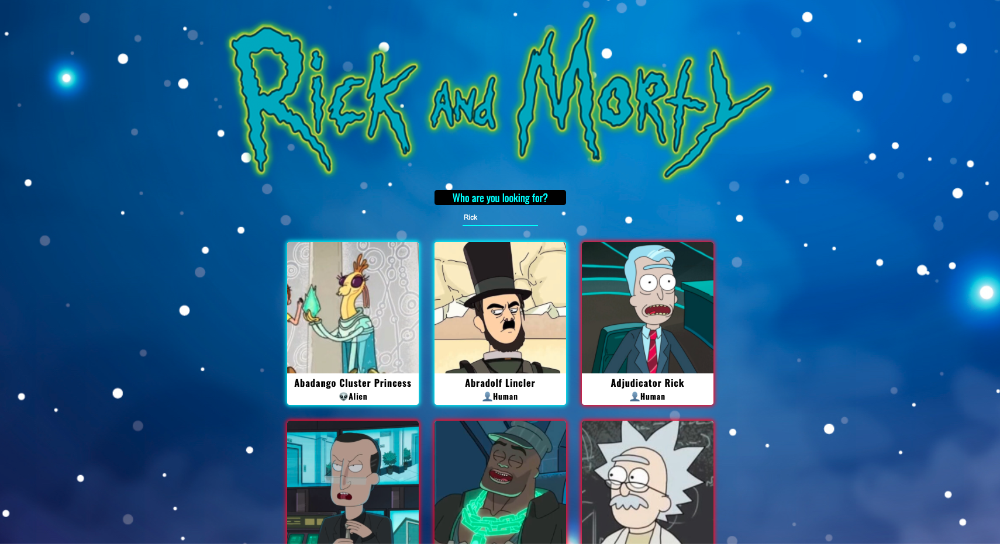

# Proyecto con React: Rick and Morty

## Instrucciones básicas

El ejercicio consiste en desarrollar una página web con un listado de personajes de Rick and Morty, que podemos filtrar por el nombre del personaje. Vamos a usar React para realizarlo.

En primer lugar, vamos a realizar una web con el listado de personajes de Rick and Morty. Para eso, vamos a utilizar el servicio de https://raw.githubusercontent.com/Adalab/rick-y-morty/master/data/rick-y-morty.json que nos devuelve información sobre los primeros 20 personajes de la serie. Sobre cada uno, vamos a pintar al menos:

    •Foto
    •Nombre
    •Especie

Ahora que ya tenemos el listado de personajes en pantalla, la segunda parte consiste en poder buscarlos por nombre.
Vamos a implementar una nueva funcionalidad: al hacer clic sobre la tarjeta de un personaje, su información aparecerá a pantalla completa. En la pantalla de detalle aparecerá además de la foto, nombre y especie:

    •Planeta de origen
    •Episodios
    •Si está vivo o muerto

## Resultado

En la vista inicial aparecen los personajes ordenados alfabéticamente. Si un personaje está vivo o no se sabe cual es su estado, su sombra es azul. En el caso de que esté muerto, su sombra es roja. Otro elemento que diferencia cada uno de los personajes es su especie. Si es humano, tendrá el icono de una persona, y si es un alien, tendrá el del alien.
En el caso de introducir un nombre que no corresponda con ninguno de los personajes, nos aparecerá un mensaje.

Cuando entramos en una tarjeta hay más detalles de el personaje en cuestión, y podemos volver al listado con la ayuda de un botón.

